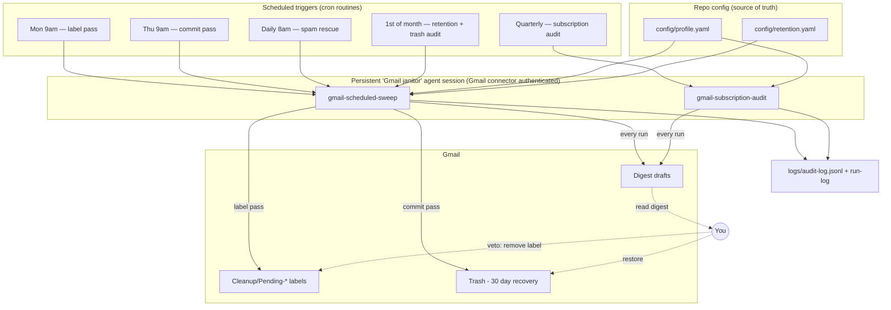
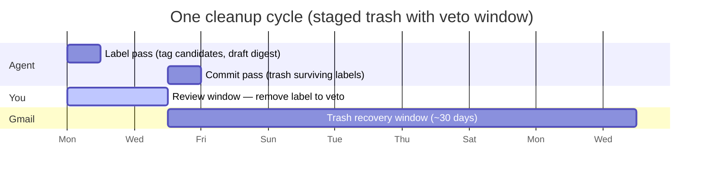
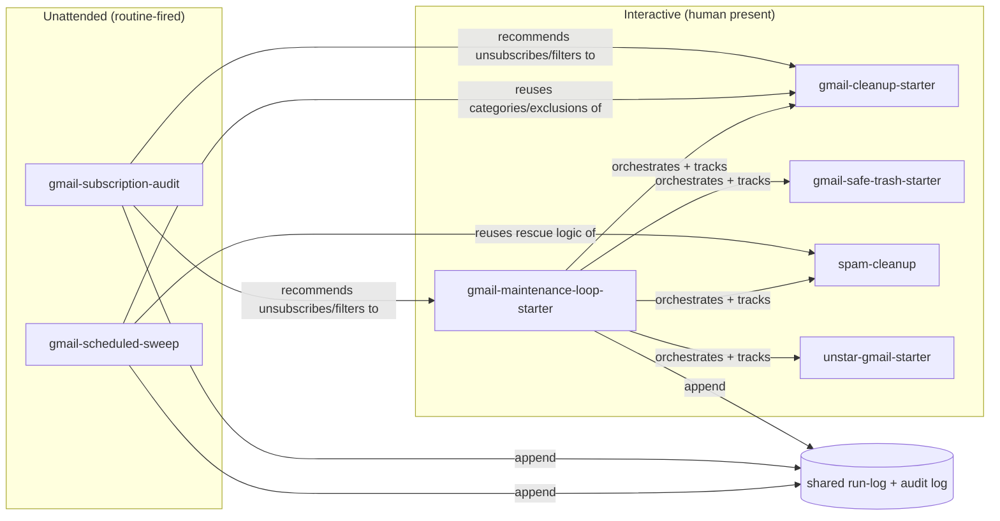

# Automating Clean Gmail with scheduled agents

This document is the wiring guide: how to take the skills in this repo and have an agent run them **unattended, on a schedule**, without weakening any Rule Zero protection. The design principle throughout: *scheduling never adds deletion power — it only adds cadence.* Anything destructive still flows through the staged two-phase pipeline with a built-in human veto window.

## Architecture

## The weekly rhythm

Every message therefore passes **three** independent chances to be saved: the query exclusions at label time, your veto during the review window, and Gmail's ~30-day Trash recovery. The commit pass never finds new candidates — it only processes labels the label pass created and you declined to remove.

## Setup (one time)

### 1. Fill in the profile

Edit [`config/profile.yaml`](config/profile.yaml): family/close contacts (required — unattended runs refuse to start without it), banks, medical, active products, approved promo senders, and set `configured: true`. Optionally enable policies in [`config/retention.yaml`](config/retention.yaml).

### 2. Create the janitor session

Interactively-authenticated connectors (like the Gmail connector on claude.ai) are attached to *sessions*, and may be absent in fresh headless sessions. So the reliable pattern is:

1. Start a dedicated agent session with this repo and a working, authorized Gmail connection. Keep it for this purpose only.
2. Run one **supervised** label pass and commit pass to verify queries, labels, digest drafts, and (importantly) whether the connector can move mail to Trash. If it is label-only, the commit pass will stage-and-report instead of trashing, and you finish commits interactively — the pipeline degrades safely rather than failing.
3. Bind the routines below **to that session** (fire-into-this-session / `persistent_session_id` mode) rather than spawn-fresh-session mode.

### 3. Create the routines

Minimum trigger interval on most schedulers is hourly; everything here is far coarser. Suggested set:

| Routine | Cron | Prompt to configure |
|---|---|---|
| Sweep: label pass | `0 9 * * 1` | "Use the gmail-scheduled-sweep skill and run the **label** pass. Read config/profile.yaml first; refuse per the skill if unconfigured." |
| Sweep: commit pass | `0 9 * * 4` | "Use the gmail-scheduled-sweep skill and run the **commit** pass. Only trash pending labels older than the review window." |
| Spam rescue | `0 8 * * *` | "Use the gmail-scheduled-sweep skill and run the **spam-rescue** pass (rescue-only; queue deletes for review)." |
| Retention + audit | `0 9 1 * *` | "Use the gmail-scheduled-sweep skill and run the **retention** pass, including the Trash audit and storage report." |
| Subscription audit | `0 9 1 1,4,7,10 *` | "Use the gmail-subscription-audit skill and produce the quarterly engagement report." |
| Nightly ETL | `0 3 * * *` | "Use the gmail-etl-nightly skill: sync Gmail metadata into the feature store (zero-mutation)." |
| Weekly dashboard | `0 10 * * 5` | "Regenerate the health dashboard (`python3 dashboard/generate_dashboard.py` after running `eval/run_eval.py`, `analysis/age_gates.py`, `analysis/drift.py` on accumulated data) and attach/summarize it." |
| Category discovery | `0 9 15 * *` | "Use the gmail-category-discovery skill and draft the monthly proposal digest (propose-only)." |

The last three power the intelligence layer — see [`INTELLIGENCE.md`](INTELLIGENCE.md). They are all zero-mutation (read, compute, report), so they need no veto window.

The label→commit gap (Mon→Thu) must stay **larger** than `sweep.review_window_days` in the profile (default 3), or the commit pass will correctly refuse to trash anything.

One-shot follow-ups also fit here: after any unusually large cleanup, schedule a single run-once trigger ~3 days out — "audit Trash for Rule Zero matches from the YYYY-MM-DD sweep and restore anything suspicious."

### 4. Read the digests, use the veto

Each run leaves a **draft** in your mailbox titled `[Clean Gmail] <pass> pass — <date>`. The only maintenance the system asks of you: skim the Monday digest, and remove the `Cleanup/Pending-*` label from anything you want kept. That's the entire veto mechanism — no config edits, no replies needed.

## Safety invariants (what unattended mode may never do)

| Invariant | Enforced by |
|---|---|
| No run without family/close-contacts list | profile precondition — skill refuses and drafts an explanation |
| Nothing trashed the same run it was found | two-phase contract: commit reads only aged labels |
| No new Gmail filters created unattended | interactive-only, owned by the starter skills |
| No unsubscribes unattended | maintenance-loop pass is opt-in + previewed, interactive only |
| No mail ever sent, only drafts | digest convention in both unattended skills |
| Bounded blast radius | `max_actions_per_run` cap; cap hits reported, never continued |
| Spam handling unattended = rescue only | `spam_rescue.unattended_mode` |
| Everything logged | append-only `logs/audit-log.jsonl`, one line per action |

## How the pieces relate

The maintenance loop stays the interactive orchestrator (and sole owner of unsubscribes); `gmail-scheduled-sweep` is its unattended counterpart; the subscription audit feeds recommendations back into the interactive skills. All three write to the same run-log, so cumulative metering ("how much have I cleaned") spans attended and unattended runs alike.
