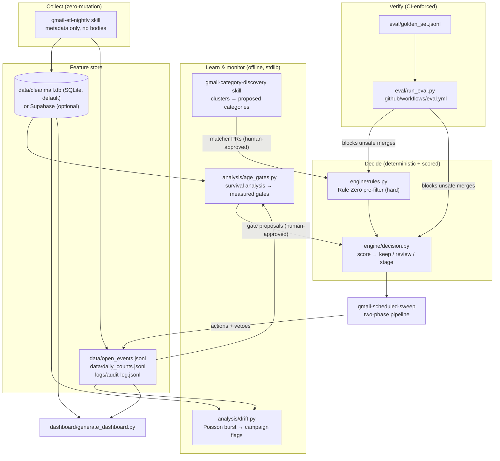
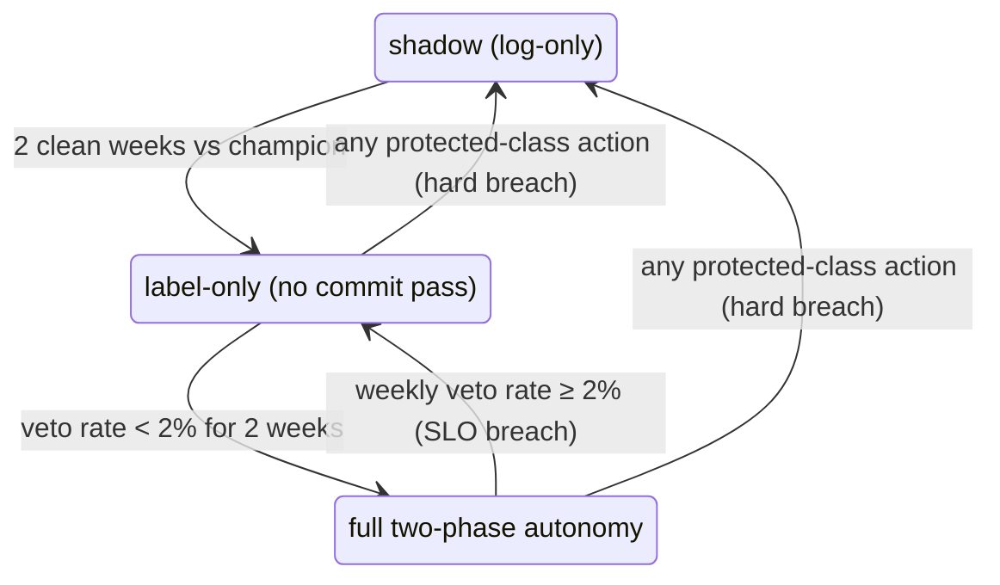

# The intelligence layer: inbox as a data product

Everything in `skills/` up through the scheduled sweep is a **rules engine** — effective, but with a precision ceiling: you can only name categories you've thought of, and the age gates are folklore. This layer turns cleanup into a **calibrated decision system with a feedback loop**, where every safety property is measured, not asserted.

**Local-first**: the default backend is a SQLite file plus JSONL logs — `python3 db/init_local.py` and you're running, nothing to sign up for. Supabase is an optional swap-in (`db/supabase_schema.sql`, `storage.backend` in the profile) with an identical schema.

## Architecture

## The six layers

### 1. Decision core (`engine/decision.py`, `config/decision.json`)

Every candidate gets `P(still has value)` and an action chosen against an asymmetric cost matrix, with an **abstention band**: auto-stage only at high confidence, route the uncertain middle to human review. Two invariants:

- The deterministic **Rule Zero pre-filter runs first** (`engine/rules.py`) — a protected message never reaches the scorer. ML only ranks within the pre-approved candidate set; it can narrow the blast radius, never widen it.
- The action space is `{keep, review, stage}` — `trash` is structurally impossible at decision time. Trashing exists only in the commit pass, days later, on staged mail nobody vetoed.

The scorer is swappable via `config/decision.json` → `"scorer"`: `"heuristic"` (default, zero setup) or `"calibrated"` (opt-in, `engine/calibrate.py`). Fitting a calibrated model is pure-Python logistic regression over whatever labeled outcomes exist — resolved vetoes/commits from `logs/audit-log.jsonl` first, the golden set's scorer-reaching rows as a bootstrap. A hard guardrail (`MIN_TRAINING_SAMPLES = 200`) refuses to write a production model on too little data; `--demo` proves the pipeline end to end on synthetic augmentation and writes to a separate, explicitly `is_demo`-stamped file that `decision.py` will never load as the production scorer, even if misnamed to the production path.

### 2. Feature store + learned age gates (`db/`, `analysis/age_gates.py`)

The nightly ETL accumulates per-sender stats, open-age observations, and daily counts — metadata only, subjects hashed, no bodies. Survival analysis then replaces folklore gates with measured ones: the recommended gate is the p95 of observed open ages ("if it were ever going to be opened, it would have happened by now"), conservative under censoring by construction. Demo output: verification codes measure to a ~3-day gate versus the hand-set 7; shipping notices to ~14 versus 60. Governance rule: **gates may only be lowered with human approval; raising is always safe.**

### 3. Category discovery (`skills/gmail-category-discovery`)

Clusters the bulk-mail *residue* the current rules miss, characterizes each cluster (volume, read rate, sampled precision including worst-case hits), and proposes draft matchers plus golden-set cases. Propose-only: adoption is a normal PR into `engine/rules.py` that CI must pass. The system does discovery; the human does governance, once per category.

### 4. Active learning (`analysis/active_learning.py`) — the veto loop

Every label-removal veto, Trash restore, and spam rescue is a labeled example, captured in the audit log with the policy's own `p_valuable` at decision time. Two uses, both implemented and both propose-only:

- **Uncertainty sampling** (`sample` subcommand): ranks scored candidates by distance to the nearest decision threshold — not confidence, its opposite. These are what the weekly digest should surface first: the most informative possible use of sixty seconds of human attention. On the golden set, the top hits are exactly the boundary cases (`p=0.20`–`0.25`), as intended.
- **Veto postmortems** (`postmortems` subcommand): reads resolved vetoes and structures the evidence — repeat-sender detection (≥2 vetoes on the same sender ⇒ propose a `never_touch` addition, high confidence) and matched-subject-term extraction via `engine.rules.CATEGORY_SUBJECT_TERMS` (⇒ propose narrowing the matcher) — into a draft golden-set case. Nothing is applied automatically; a proposal becomes real only as a human-reviewed PR that `eval/run_eval.py` must still pass, same governance as category discovery.

### 5. Evaluation, shadow mode, champion/challenger (`eval/`, CI)

- **Golden set** (`eval/golden_set.jsonl`, 32 cases): hand-labeled, including the adversarial traps — mom forwarding a coupon, a receipt phrased like a shipping notice, and four *unprotected-but-valuable* category-matched cases (a still-needed verification code, a forgotten active product, a delivery dispute, a still-redeemable coupon) that exercise the abstention band specifically. Grow it from real audit history; the seeds are synthetic and marked as such.
- **CI gate** (`.github/workflows/eval.yml`): every PR runs the golden-set eval, a champion/challenger shadow comparison, the calibration guardrail (must refuse without enough data or `--demo`), and smoke tests for every analysis script. A change that would stage a protected message **fails the build** — safety regressions become unmergeable, not just impolite.
- **Shadow mode / champion vs. challenger** (`eval/shadow_compare.py`): runs a champion and a challenger policy (different thresholds, or the calibrated scorer) side by side over the same cases and classifies every disagreement as `improvement`, `changed`, or `REGRESSION` — a regression is *either* a protected-class action *or* any valuable message auto-staged, mirroring the CI gate's own two failure modes exactly. Promotion is recommended only with zero regressions and recall ≥ champion; a caught example: raising the stage threshold looked like a strict improvement on junk recall until the tool flagged that it also auto-staged all four abstention-band valuable cases — correctly blocked. Real production shadow mode (a challenger logged against live traffic, `policy: shadow:<name>` in the actions table) is `gmail-scheduled-sweep`'s to run once real audit history exists; this script is the analysis you'd run on the result.

### 6. Drift & campaign detection (`analysis/drift.py`)

Poisson tail tests on per-sender daily counts flag rate discontinuities (a quiet sender exploding, a lookalike domain appearing at volume) — the statistical signature of a spam/phishing campaign, caught hours before a human would notice. Flags feed the existing suggest-first phishing flow; detection never auto-deploys a filter.

## The autonomy ladder (SLOs with automatic degradation)

Error budget (`config/decision.json` → `slo`): protected-class false trash = **zero tolerance, ever** (enforced by the deterministic pre-filter and the CI gate, not by the model); weekly veto rate < 2%. On breach the sweep demotes itself and says why in the digest. The system earns autonomy by being right; it never argues for it.

## Dashboard

`python3 dashboard/generate_dashboard.py` renders `dashboard/index.html` from whatever local data exists: golden-set safety tiles, production action counts and veto rate vs. SLO, learned-gate table, drift flags. One glance answers "is the system healthy, and is it earning more autonomy or less." Wire it to a weekly routine (see `AUTOMATION.md`).

## Build order & current maturity

| Layer | Artifact | Status |
|---|---|---|
| 5. Eval + CI | `eval/run_eval.py`, `eval/shadow_compare.py`, `eval.yml` | **Running** — 32-case golden set, champion/challenger comparison, all gate CI |
| 1. Decision core | `engine/decision.py`, `engine/rules.py` | **Running** — heuristic scorer is the zero-setup default |
| 1b. Calibration | `engine/calibrate.py` | **Running** (guardrailed) — refuses to train below 200 real outcomes; `--demo` proves the pipeline on synthetic data only |
| 2a. Local store | `db/init_local.py` | **Running** — SQLite, zero setup |
| 2b. ETL | `skills/gmail-etl-nightly` | Skill ready — wire to nightly routine to start accumulating real data |
| 2c. Learned gates | `analysis/age_gates.py` | **Running** — on demo data until ETL accumulates |
| 6. Drift | `analysis/drift.py` | **Running** — on demo data until ETL accumulates |
| 4. Active learning | `analysis/active_learning.py` | **Running** — uncertainty sampling + veto postmortems, both propose-only |
| 3. Discovery | `skills/gmail-category-discovery` | Skill ready — monthly routine or on demand |
| Dashboard | `dashboard/` | **Running** |
| Supabase backend | `db/supabase_schema.sql` | Optional — apply schema, flip `storage.backend` |

Every "Running" row above executes with zero setup on synthetic/demo data today, and automatically upgrades to real data the moment `gmail-etl-nightly` and `gmail-scheduled-sweep` start accumulating `logs/audit-log.jsonl` and the feature store — no code changes required, only real history. The two "Skill ready" rows are the only pieces that need your actual Gmail account connected via a routine (see `AUTOMATION.md`) to start producing real numbers instead of demo ones.
