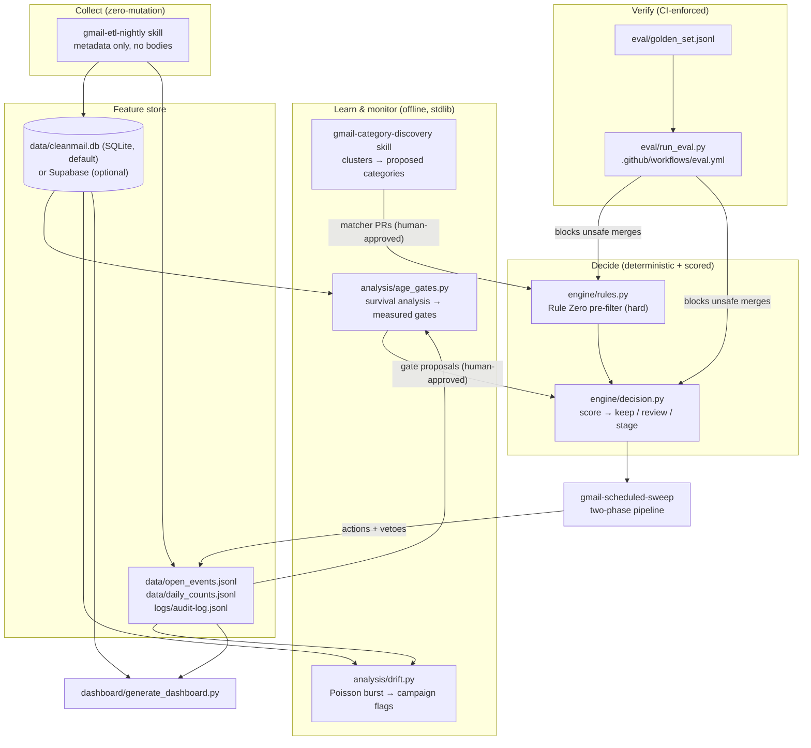
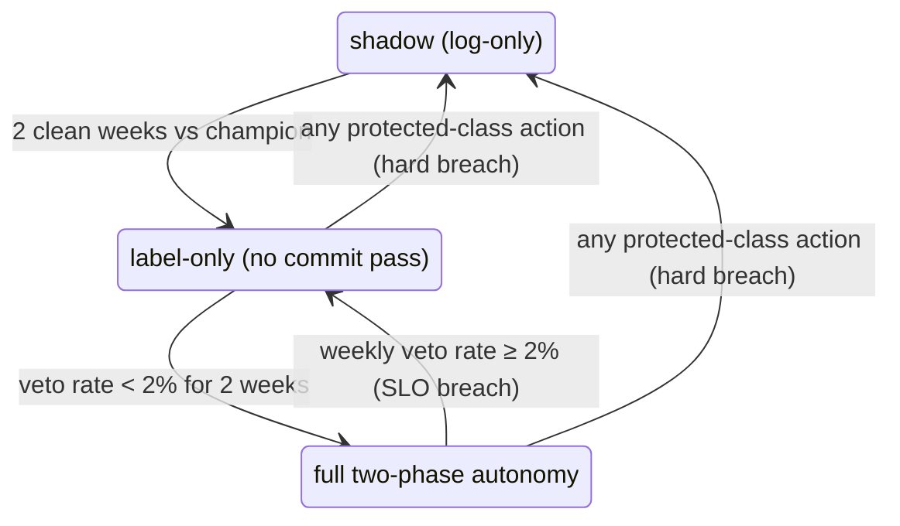

# The intelligence layer: inbox as a data product

Everything in `skills/` up through the scheduled sweep is a **rules engine** — effective, but with a precision ceiling: you can only name categories you've thought of, and the age gates are folklore. This layer turns cleanup into a **calibrated decision system with a feedback loop**, where every safety property is measured, not asserted.

**Local-first**: the default backend is a SQLite file plus JSONL logs — `python3 db/init_local.py` and you're running, nothing to sign up for. Supabase is an optional swap-in (`db/supabase_schema.sql`, `storage.backend` in the profile) with an identical schema.

## Architecture

## The six layers

### 1. Decision core (`engine/decision.py`, `config/decision.json`)

Every candidate gets `P(still has value)` and an action chosen against an asymmetric cost matrix, with an **abstention band**: auto-stage only at high confidence, route the uncertain middle to human review. Two invariants:

- The deterministic **Rule Zero pre-filter runs first** (`engine/rules.py`) — a protected message never reaches the scorer. ML only ranks within the pre-approved candidate set; it can narrow the blast radius, never widen it.
- The action space is `{keep, review, stage}` — `trash` is structurally impossible at decision time. Trashing exists only in the commit pass, days later, on staged mail nobody vetoed.

The heuristic scorer is the deliberately swappable part: once the feature store holds real outcomes, replace it with a calibrated model (conformal prediction for the abstention band) without touching the decision rule or the pre-filter.

### 2. Feature store + learned age gates (`db/`, `analysis/age_gates.py`)

The nightly ETL accumulates per-sender stats, open-age observations, and daily counts — metadata only, subjects hashed, no bodies. Survival analysis then replaces folklore gates with measured ones: the recommended gate is the p95 of observed open ages ("if it were ever going to be opened, it would have happened by now"), conservative under censoring by construction. Demo output: verification codes measure to a ~3-day gate versus the hand-set 7; shipping notices to ~14 versus 60. Governance rule: **gates may only be lowered with human approval; raising is always safe.**

### 3. Category discovery (`skills/gmail-category-discovery`)

Clusters the bulk-mail *residue* the current rules miss, characterizes each cluster (volume, read rate, sampled precision including worst-case hits), and proposes draft matchers plus golden-set cases. Propose-only: adoption is a normal PR into `engine/rules.py` that CI must pass. The system does discovery; the human does governance, once per category.

### 4. Active learning (the veto loop)

Every label-removal veto, Trash restore, and spam rescue is a labeled example, captured in the audit log with the policy's own `p_valuable` at decision time. Two uses:

- **Uncertainty sampling**: the weekly digest surfaces the K messages in the abstention band the scorer was least sure about — the most informative possible use of sixty seconds of human attention.
- **Veto postmortems**: each veto triggers a diagnosis of *which feature or rule* caused the false positive, and the fix lands as a golden-set case + rule narrowing, so every mistake permanently improves the system.

### 5. Evaluation, shadow mode, champion/challenger (`eval/`, CI)

- **Golden set** (`eval/golden_set.jsonl`): hand-labeled cases including the adversarial traps — mom forwarding a coupon, a receipt phrased like a shipping notice. Grow it from real audit history; the seeds are synthetic and marked as such.
- **CI gate** (`.github/workflows/eval.yml`): every PR runs the eval. A change that would stage a protected message **fails the build** — safety regressions become unmergeable, not just impolite. Recall floors stop silent decay in the other direction.
- **Shadow mode**: a challenger policy runs log-only (`policy: shadow:<name>` in the actions table), recording what it *would* have done on real traffic. Promote on evidence — e.g. "challenger catches 23% more junk at equal veto rate" — never on vibes.

### 6. Drift & campaign detection (`analysis/drift.py`)

Poisson tail tests on per-sender daily counts flag rate discontinuities (a quiet sender exploding, a lookalike domain appearing at volume) — the statistical signature of a spam/phishing campaign, caught hours before a human would notice. Flags feed the existing suggest-first phishing flow; detection never auto-deploys a filter.

## The autonomy ladder (SLOs with automatic degradation)

Error budget (`config/decision.json` → `slo`): protected-class false trash = **zero tolerance, ever** (enforced by the deterministic pre-filter and the CI gate, not by the model); weekly veto rate < 2%. On breach the sweep demotes itself and says why in the digest. The system earns autonomy by being right; it never argues for it.

## Dashboard

`python3 dashboard/generate_dashboard.py` renders `dashboard/index.html` from whatever local data exists: golden-set safety tiles, production action counts and veto rate vs. SLO, learned-gate table, drift flags. One glance answers "is the system healthy, and is it earning more autonomy or less." Wire it to a weekly routine (see `AUTOMATION.md`).

## Build order & current maturity

| Layer | Artifact | Status |
|---|---|---|
| 5. Eval + CI | `eval/`, `eval.yml` | **Running** — passes on seed golden set; grow with real cases |
| 1. Decision core | `engine/` | **Running** — heuristic scorer; swap for calibrated model later |
| 2a. Local store | `db/init_local.py` | **Running** — SQLite, zero setup |
| 2b. ETL | `skills/gmail-etl-nightly` | Skill ready — wire to nightly routine |
| 2c. Learned gates | `analysis/age_gates.py` | **Running** — on demo data until ETL accumulates |
| 6. Drift | `analysis/drift.py` | **Running** — on demo data until ETL accumulates |
| 4. Active learning | audit log conventions | Collecting — postmortem flow is manual for now |
| 3. Discovery | `skills/gmail-category-discovery` | Skill ready — monthly routine or on demand |
| Dashboard | `dashboard/` | **Running** |
| Supabase backend | `db/supabase_schema.sql` | Optional — apply schema, flip `storage.backend` |
