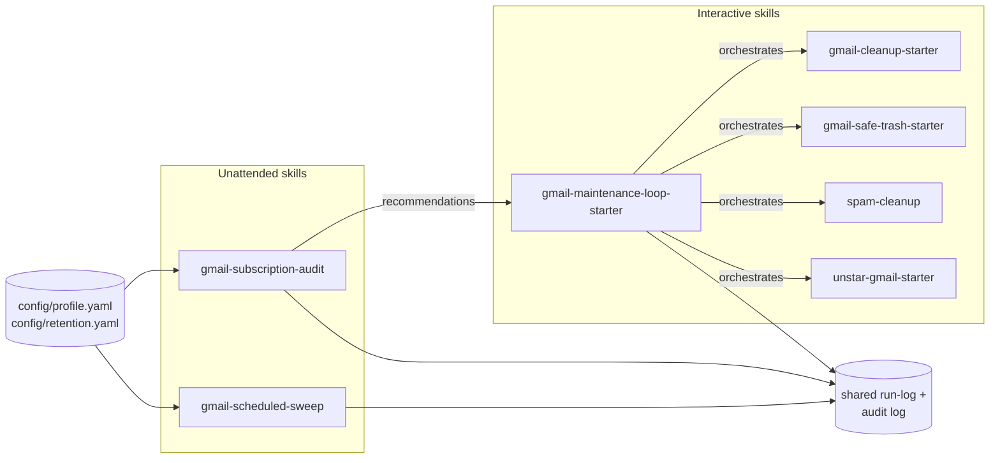
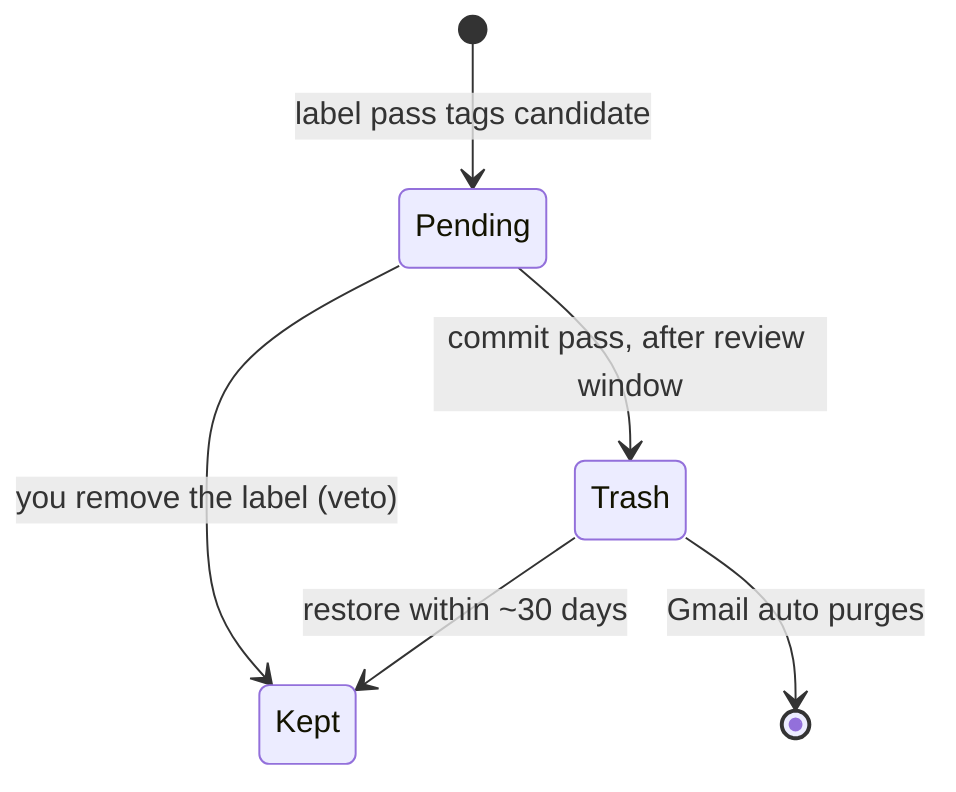
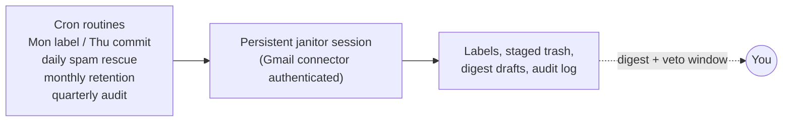

# Clean Gmail Skills

A safety-first collection of reusable Gmail cleanup skills, plus a config layer and scheduling guide for running them unattended. These skills are designed to help an assistant remove stale, low-value Gmail clutter while reassuring the user that important mail stays protected.

**Interactive skills** (a human is present and approving):

| Skill | Best for | Personality |
|---|---|---|
| `gmail-cleanup-starter` | General inbox cleanup setup prompts | Friendly cleanup language |
| `gmail-safe-trash-starter` | Users who want extra reassurance around deletion safety | Explicit “safe trash” framing |
| `spam-cleanup` | Reviewing Gmail Spam for false positives and obvious junk | Three-bucket rescue / delete / leave workflow |
| `unstar-gmail-starter` | Pruning stale stars while protecting the ones that matter | Approval-gated, star-only, fully reversible |
| `gmail-maintenance-loop-starter` | Running the skills above on a cadence with a persistent run-log | Orchestration + metering, opt-in unsubscribe pass |

**Unattended skills** (fired by scheduled routines, no human in the loop — see [`AUTOMATION.md`](AUTOMATION.md)):

| Skill | Best for | Safety model |
|---|---|---|
| `gmail-scheduled-sweep` | Weekly automated cleanup | Two-phase staged trash: label first, trash days later, human veto window in between |
| `gmail-subscription-audit` | Quarterly bulk-sender engagement report | Report-only — mutates nothing, ever |
| `gmail-etl-nightly` | Feeding the feature store with Gmail metadata | Zero-mutation, metadata-only, no bodies |
| `gmail-category-discovery` | Finding junk types the rules miss | Propose-only — adoption is a CI-gated code change |

All skills share the same operating philosophy: **move only clearly stale junk to Gmail Trash, never permanently delete, and never touch receipts, financial records, medical records, family messages, close-friend messages, sent mail, or drafts.** The `spam-cleanup` skill adds a Spam-folder-specific safety layer: rescue likely false positives to Inbox, trash only unmistakable junk, and leave promotions or ambiguous messages untouched.



---

## Quick reassurance

If you are giving this to a non-technical user, start here:

> This cleanup is intentionally conservative. It does not permanently delete anything. It moves only narrow categories of stale notification clutter to Gmail Trash, where Gmail keeps messages recoverable for about 30 days. Before any persistent filters are deployed, the assistant asks for people and institutions that should never be touched.

### What “safe” means here

```text
User setup answers
        │
        ▼
Never-touch protections
(family, friends, receipts, banks, medical, active products)
        │
        ▼
Narrow junk categories only
(2FA codes, old verify prompts, stale promos, old invites, onboarding noise)
        │
        ▼
Preview counts and borderline senders
        │
        ▼
Move to Trash only
(recoverable window, no permanent deletion)
        │
        ▼
Audit Trash and restore anything suspicious
```

---

## The core promise: Rule Zero

Every skill in this repo is built around **Rule Zero**:

1. **Never touch receipts or financial records.**  
   That includes receipts, invoices, order confirmations, billing notices, subscription renewals, refunds, payment confirmations, tax records, statements, and anything that could prove a transaction.

2. **Never touch family or close-friend messages.**  
   The assistant must collect a user-provided list of never-delete senders before deploying filters. Those senders are excluded from every filter, even when the filter category seems unrelated.

These two rules override every cleanup idea. If a query might catch a receipt or a personal message, the skill narrows the query or skips that category entirely.

---

## Cleanup categories

The skills use clear categories so the user can understand exactly what is happening.

| Category | Typical match | Default age gate | Default behavior | User involvement |
|---|---:|---:|---|---|
| Verification codes | Login, 2FA, OTP, security codes | Older than 7 days | Trash | Usually no pause |
| Email verification prompts | “Confirm your email,” “activate your account” | Older than 30 days | Trash | Usually no pause |
| Shipping notices | Shipped, delivered, out for delivery | Older than 60 days | Trash for backlog; archive for ongoing filters | Watch for order wording |
| Calendar invites | `.ics` attachments for past events | Older than 14 days | Trash | Keep-list for recurring bookings |
| Unopened promotions | Unread Gmail Promotions category | Older than 30 days | Trash selected senders | Mandatory sender review |
| Welcome/onboarding | “Welcome to,” “getting started,” setup nudges | Older than 60 days | Trash | Extra receipt audit |
| Phishing watch | Scam-like campaign patterns | Newer than 14 days detection | Suggest filters; optionally auto-deploy airtight alias filters | Suggest-first by default |
| Spam false-positive review | Messages already in Spam | Current Spam folder | Rescue to Inbox, Trash unmistakable junk, or leave in Spam | Mandatory preview and confirmation |

---

## Skill-by-skill guide

### `gmail-cleanup-starter`

Use this as the general-purpose Gmail cleanup starter. It is best when the user asks for safe inbox cleanup across stale verification codes, confirm-your-email prompts, old shipping notices, past calendar invites, unread promotions, onboarding sequences, or phishing-watch suggestions. It emphasizes friendly setup language and a conservative preview-first cleanup flow.

### `gmail-safe-trash-starter`

Use this when the user needs stronger reassurance before allowing cleanup. It follows the same narrow cleanup categories and Rule Zero protections as `gmail-cleanup-starter`, but frames actions around Gmail Trash as a recoverable holding area rather than irreversible deletion. This is the best default for cautious users or non-technical users who are worried about losing important mail.

### `spam-cleanup`

Use this when the user specifically wants to review or clean the Gmail Spam folder. It uses a three-bucket model:

| Bucket | Action | When to use |
|---|---|---|
| RESCUE | Move to Inbox | Prior correspondence, plausible transactional mail, personal messages, or allowlisted senders |
| DELETE | Move to Trash | High-confidence scams, phishing, impersonation, or explicitly denylisted senders |
| LEAVE | Do nothing | Promotions, foreign-language bulk without clear malicious signals, or anything ambiguous |

The Spam workflow always previews proposed rescues and deletes, waits for confirmation, and learns from confirmed decisions with allowlist, denylist, and audit-log files.

### `unstar-gmail-starter`

Use this when the starred label has become noise. It buckets stars into removable (past events, delivered orders, promo pitches, old newsletters) versus always-kept (travel bookings, personal mail, financial/receipts/tax, reference notes, active action items), proposes the buckets, and unstars only what the user approves. It never deletes or archives — only the star is touched, and re-starring undoes everything.

### `gmail-maintenance-loop-starter`

Use this to run the cleanup/unstar skills on a recurring cadence with a persistent, append-only run-log so per-run and cumulative counts stay visible. It executes nothing destructive itself, and it owns the one outbound action in the project: an opt-in, previewed, metered unsubscribe pass with a mandatory never-list.

### `gmail-scheduled-sweep`

The unattended counterpart to the starters, built for cron-fired routines. It reads `config/profile.yaml` instead of asking setup questions, and it splits deletion into a two-phase pipeline: a **label pass** tags candidates with a dated `Cleanup/Pending-*` label and drafts a digest; a **commit pass** days later trashes only labels older than the review window — removing the label is the user's veto. It also runs a rescue-only spam sweep, monthly retention/Trash-audit passes, and enforces a hard per-run action cap.



### `gmail-subscription-audit`

A report-only engagement audit of bulk senders: volume, read rate, replies, and time since last open, tiered into KEEP / REVIEW / CUT candidates. It changes nothing — recommendations flow to the maintenance loop's unsubscribe pass or the starters' filter pass for any actual action, which keeps it safe to schedule quarterly.

---

## User setup checklist

Before first use, the assistant should ask for these answers in plain language. For **unattended** runs the same answers live in [`config/profile.yaml`](config/profile.yaml) instead — scheduled agents can't ask questions, so `gmail-scheduled-sweep` refuses to run until that file is configured (and always refuses if the family/close-friends list is empty).

1. **Family and close friends**  
   “Which email addresses should I treat as never-deleteable, no matter what subject they match?”

2. **Banks and financial institutions**  
   Examples: Chase, Schwab, Fidelity, Wells Fargo, credit unions, payroll platforms.

3. **Insurance and medical providers**  
   Examples: MyChart, Kaiser, Blue Cross Blue Shield, lab providers, pharmacies.

4. **Active products and subscriptions**  
   Any tools, SaaS products, apps, memberships, or subscriptions where onboarding emails might matter.

5. **Recurring confirmations to keep**  
   Examples: school notices, gym check-ins, class bookings, medical appointment reminders, professional services.

6. **E-commerce brands they actually shop with**  
   This helps separate unwanted promotions from brands the user might still care about.

7. **Sent/replied-thread safety**  
   Any existing filters or habits where the user replies to threads that might look like onboarding or promo mail.

8. **Phishing preferences**  
   Whether the user has an old alias that only receives spam, and whether airtight phishing filters should be suggested first or auto-deployed.

---

## Options users can choose

### Cleanup mode

| Option | What it does | Recommended for |
|---|---|---|
| Preview only | Shows counts and suspicious senders, changes nothing | First-time or cautious users |
| Conservative cleanup | Runs only the narrowest categories and asks before promotions | Most users |
| Filter setup | Creates ongoing Gmail filters after preview and approval | Users who want the inbox to stay clean |
| Phishing watch | Looks for repeated scam campaigns and proposes safe filters | Users getting repeated scam bursts |

### Promotion handling

| Option | Description |
|---|---|
| Skip promotions | Do not touch Promotions at all |
| Review top senders | Show sender counts and let the user approve obvious junk |
| Approved senders only | Trash only senders the user explicitly approved |

### Phishing handling

| Option | Description |
|---|---|
| Suggest-first | Default. The assistant proposes filters but waits for confirmation |
| Auto-deploy airtight signals | Only for very narrow cases like a dead alias plus repeated scam subjects |
| Report only | Detect campaigns but make no filter changes |

---

## Safety architecture

```text
┌────────────────────────────┐
│ 1. Ask setup questions      │
└─────────────┬──────────────┘
              ▼
┌────────────────────────────┐
│ 2. Build global exclusions  │
│    - family/friends         │
│    - receipts/billing       │
│    - banks/medical          │
│    - active products        │
└─────────────┬──────────────┘
              ▼
┌────────────────────────────┐
│ 3. Preview each category    │
│    and show risky senders   │
└─────────────┬──────────────┘
              ▼
┌────────────────────────────┐
│ 4. Apply narrow filters     │
│    through Gmail UI         │
└─────────────┬──────────────┘
              ▼
┌────────────────────────────┐
│ 5. Audit Trash              │
│    restore anything wrong   │
└────────────────────────────┘
```

---

## How to install or share a skill

Copy one of the skill folders into your assistant skill directory:

```text
skills/gmail-cleanup-starter/
skills/gmail-safe-trash-starter/
skills/spam-cleanup/
skills/unstar-gmail-starter/
skills/gmail-maintenance-loop-starter/
skills/gmail-scheduled-sweep/
skills/gmail-subscription-audit/
```

Use `gmail-cleanup-starter` when you want general cleanup wording. Use `gmail-safe-trash-starter` when the user benefits from stronger reassurance that the workflow is conservative and recoverable. Use `spam-cleanup` when the user wants to review Gmail Spam, rescue false positives, or trash only unmistakable junk already caught by Spam. Use `unstar-gmail-starter` to prune the starred label. Use `gmail-maintenance-loop-starter` to run any of these on a cadence with a persistent tracker. The two unattended skills (`gmail-scheduled-sweep`, `gmail-subscription-audit`) additionally need `config/profile.yaml` filled in and routines wired up per [`AUTOMATION.md`](AUTOMATION.md).

---

## Automation and scheduling

Full guide: [`AUTOMATION.md`](AUTOMATION.md) — janitor-session setup, cron routine table, copy-paste prompts, and the unattended safety invariants. The short version:



Scheduling never adds deletion power — unattended runs can label, trash *previously staged and un-vetoed* mail, rescue spam false positives, and draft reports. Filters and unsubscribes stay interactive-only.

---

## The intelligence layer

Full design: [`INTELLIGENCE.md`](INTELLIGENCE.md). On top of the rules engine sits a measured, CI-gated decision system — **local-first** (SQLite + JSONL, zero external setup; Supabase optional):

- `engine/` — deterministic Rule Zero pre-filter + scored decisions with an abstention band. Action space is `{keep, review, stage}`; trash is structurally impossible at decision time.
- `eval/` + `.github/workflows/eval.yml` — a golden set of adversarial traps (mom forwards a coupon; a receipt phrased like a shipping notice) run in CI on every PR. **A change that would stage a protected message cannot merge.**
- `db/` — feature store: `python3 db/init_local.py` for the default SQLite backend; `db/supabase_schema.sql` if you opt into cloud.
- `analysis/` — survival-analysis age gates (measured, not folklore) and Poisson burst detection for spam campaigns.
- `dashboard/` — one-command static health dashboard: safety tiles, veto rate vs. SLO, learned gates, drift flags.

```text
python3 eval/run_eval.py                      # safety eval (CI runs this too)
python3 db/init_local.py                      # local feature store, no signup
python3 analysis/age_gates.py --demo          # learned age gates
python3 analysis/drift.py --demo              # campaign detection
python3 dashboard/generate_dashboard.py       # health dashboard
```

---

## Maintainer notes and improvement review

The skill content has been reviewed for clarity and consistency. Recommended ongoing improvements:

- Keep the two starters aligned when safety logic changes.
- Keep `spam-cleanup` aligned with the same Trash-only, preview-first safety posture while preserving its Spam-specific rescue/delete/leave model.
- Preserve the required setup question for family and close friends.
- Keep phishing behavior suggest-first unless the matching signal is extremely narrow.
- Treat welcome/onboarding filters as the highest collateral-risk category because body text may contain order or subscription details.
- Add new “lessons learned” whenever a real deployment finds a borderline pattern.

---

## Final user-facing script

When starting a cleanup, a friendly assistant can say:

> I can help clean stale Gmail clutter safely. I’ll start with a preview, and I won’t permanently delete anything. I also need your never-touch list first: family, close friends, banks, medical providers, and any active products or subscriptions. If anything looks borderline, I’ll pause and ask instead of guessing.
