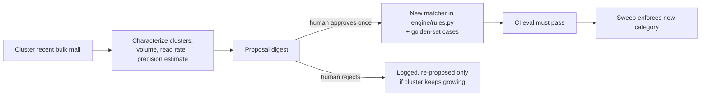

# Gmail Category Discovery

The seven engine categories are hand-written; this skill inverts the maintenance burden. The system does discovery, the human does governance: each proposal is approved exactly once, and from then on the sweep catches that junk type forever.

## Propose-only guarantee

This skill's output is a **proposal document** (digest draft or report), nothing else. It never labels, trashes, or edits the engine. Adoption of a proposal is a code change — reviewed like any other, and gated by CI:

## Method

1. **Corpus**: bulk mail from the last 90 days (Promotions/Updates or List-Id present), excluding everything Rule Zero protects and everything the existing categories already match — discovery only looks at the *residue* the current rules miss.
2. **Cluster** by similarity of subject + snippet (embedding-based if available; otherwise normalized-subject templates — strip numbers/dates/names, group identical skeletons like `"your weekly ___ report"`). Same-List-Id mail pre-groups.
3. **Characterize each cluster** with at least 20 members: size, distinct senders, read rate, age distribution, three example subjects, and a **draft matcher** (subject terms + any sender/List-Id constraint).
4. **Estimate precision**: run the draft matcher over the corpus; sample up to 25 hits and check for anything valuable-looking (receipts, personal, protected senders). Report the sampled precision and every questionable hit — the human sees the worst cases, not just the average.
5. **Propose**: digest with clusters ranked by volume × (1 − read rate). For each: the evidence, the draft matcher, a suggested age gate (from survival analysis when data exists), and 3–5 draft golden-set cases (junk examples plus the nearest valuable look-alikes).

## Adopting a proposal

1. Add the matcher to `engine/rules.py` and the gate to `config/profile.yaml` age gates.
2. Add the proposal's golden-set cases to `eval/golden_set.jsonl` — including the adversarial look-alikes.
3. Open a PR; `eval.yml` CI must pass (no protected staging, recall floors hold).
4. The new category flows through the normal two-phase sweep like any other — no special path.

## Scheduling

Monthly routine or on demand (see `AUTOMATION.md`). Rejected proposals are logged so they are only re-raised if the cluster keeps growing.
