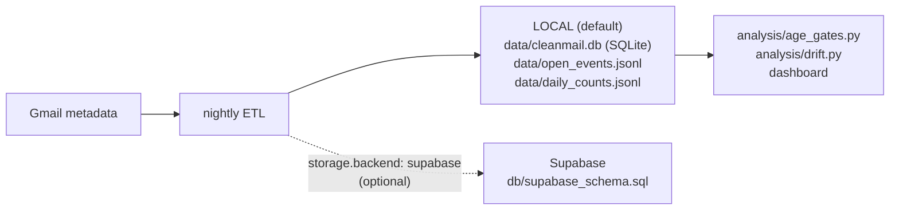

# Gmail Nightly ETL

The data-collection layer under the intelligence stack. Everything the learned components need — survival-based age gates, engagement tiers, drift detection, and eventually a trained scorer — comes from the observations this pass accumulates. It mutates nothing in Gmail.

## Zero-mutation, metadata-only guarantee

- **Reads only.** No labels, no trash, no rescue, no drafts, no filters.
- **Metadata only.** Sender, dates, thread ids, Gmail category, List-Id, read/unread, reply presence, and the subject **hashed** (raw subjects live only transiently for engine category matching). Message bodies are never extracted or stored.
- Runs need no profile preconditions (nothing destructive can happen), but reads `config/profile.yaml` to mark protected senders in the store.

## Backends

Default is **local**: `python3 db/init_local.py` once, then this skill appends to `data/cleanmail.db` and the two JSONL files. Nothing to sign up for. If `storage.backend: "supabase"` is set in the profile, write the same rows to the Supabase tables instead (schema in `db/supabase_schema.sql`); the JSONL files are still written so the offline analysis scripts keep working either way.

## What each run does

1. **Window**: since the last recorded run (from the store), capped at 7 days; first run backfills 30 days.
2. **Per-message rows** → `messages`: id, thread, sender, subject hash, received date, Gmail category, List-Id, engine category match (via `engine/rules.py` semantics).
3. **Open-age observations** → `data/open_events.jsonl`: for messages that became read since the last run, `{category, age_at_open_days}`; for aged-out unread messages, censored records `{category, observed_days}`. This is the survival-analysis input.
4. **Per-sender daily counts** → `data/daily_counts.jsonl` and `daily_counts` table. This is the drift-detection input.
5. **Sender rollups** → `senders`: totals, unread counts, replied-thread counts, last-open date; recompute engagement tier using the subscription-audit thresholds; stamp `protected` from the profile.
6. **Log one summary line** to the run log: window, messages ingested, senders updated, backend used.

Keep API traffic proportionate: incremental windows, count-style queries where possible, and stop early (with a note in the run log) rather than paging unboundedly if a window is unexpectedly huge.

## Scheduling

Nightly routine (`0 3 * * *`) in the janitor session — see `AUTOMATION.md`. Safe at any frequency; more often than daily just burns quota. Downstream consumers (`analysis/age_gates.py`, `analysis/drift.py`, `dashboard/generate_dashboard.py`) run on their own schedules and read whatever has accumulated.
