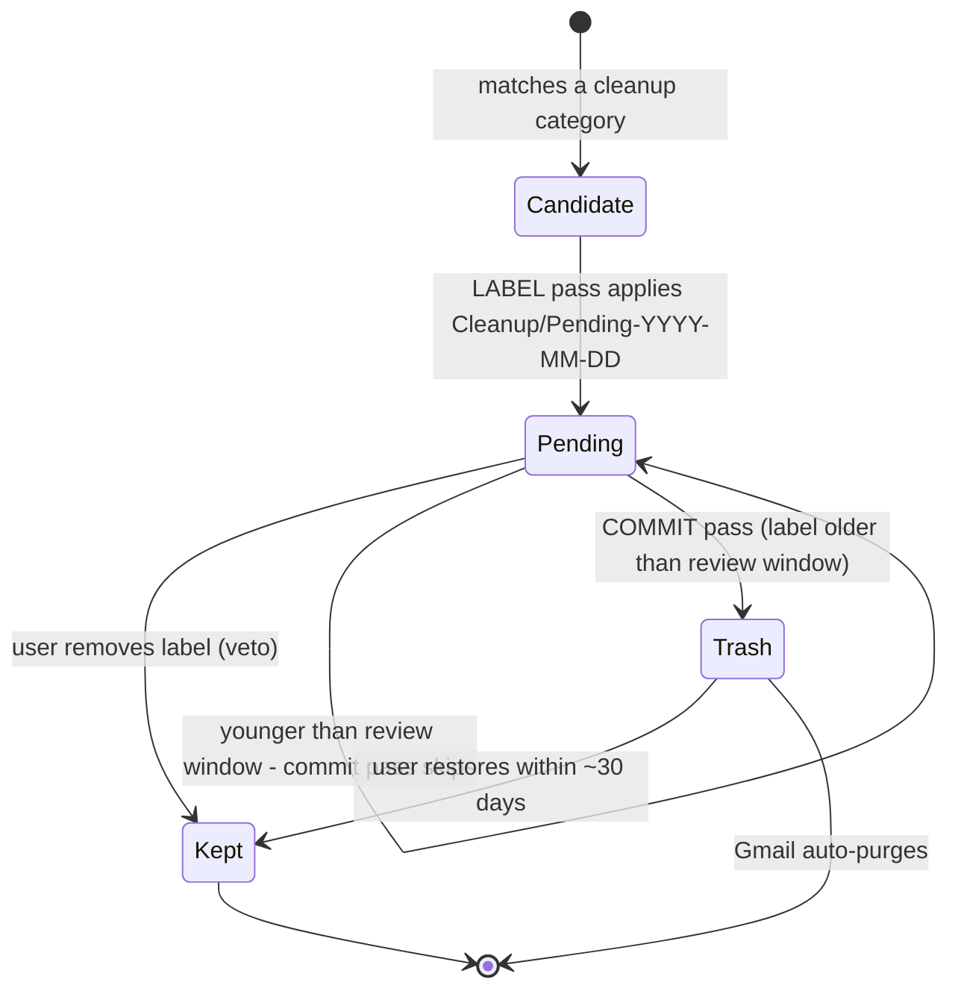

# Gmail Scheduled Sweep

The unattended member of the Clean Gmail family. Everything the other skills do with a human watching, this skill restructures so it is safe with **nobody watching**: it never asks questions, never widens scope, and splits every destructive decision into two runs separated by a human review window.

## The two-phase contract



1. **LABEL pass** (e.g. Mondays): find candidates, apply a dated label `<pending_label_prefix>-YYYY-MM-DD`, change nothing else, draft a digest.
2. **Review window**: the user has `review_window_days` (default 3) to remove the label from anything they want kept. Removing the label is the veto — nothing else required.
3. **COMMIT pass** (e.g. Thursdays): trash ONLY messages still carrying a pending label **older than the review window**. A label dated today or yesterday is never committed, even if present.

The commit pass never searches for new candidates. Its input is exclusively the surviving pending labels. This means the blast radius of any run is fixed at label time and can only shrink afterwards.

## Rule Zero — unattended edition

All Rule Zero protections from the starter skills apply, plus these hardenings because no human is present:

1. **Refuse to run without a configured profile.** Read `config/profile.yaml`. If `configured` is false, or `never_touch.family_and_close_contacts` is empty, DO NOT run any pass. Instead draft a message to the owner explaining what is missing, log the refusal, and stop.
2. **Never ask, never assume.** If a category's inputs are missing (e.g. no `approved_promo_senders`), skip that category and note the skip in the digest. Skipping is always correct; guessing never is.
3. **Thread-participation guard.** Exclude any thread the user has replied in: for each candidate thread, if any message in the thread is from the owner (or the thread appears in `in:sent`), skip it. A conversation the user participated in is never junk.
4. **Hard action cap.** Stop at `sweep.max_actions_per_run` labels/trashes per run. If the cap is hit, report it in the digest rather than continuing — an unexpectedly huge candidate set is a signal something is wrong with a query.
5. **No filter deployment unattended.** Creating persistent Gmail filters remains an interactive-only action (the starter skills own it). This skill only labels, trashes staged mail, rescues spam, and reports.
6. **Trash only, never permanent-delete, never empty Trash** — inherited unchanged.

## Passes

### `label` — the Monday pass

For each enabled category in `age_gates` (verification codes, verification prompts, shipping notices, past calendar invites, approved unopened promos, onboarding, duplicate digests, expired offers):

1. Build the category query with ALL global exclusions from the profile (`never_touch.*` senders, Rule Zero subject/domain exclusions from the starter skills, `-is:starred -is:important`, thread-participation guard).
2. **Duplicate-digest collapse**: within same-sender, same-normalized-subject groups (daily digests, CI mail, price alerts), keep the newest `duplicate_collapse_keep_latest`, label the rest past the age gate. By construction the newest copies are always kept.
3. **Calendar invite cross-check**: if a Google Calendar connector is available, verify the event date is actually in the past before labeling; if unavailable, require the age gate at 2x.
4. Apply `Cleanup/Pending-YYYY-MM-DD` (create the label if missing) up to the action cap.
5. Append one audit-log line per labeled thread; finish with the digest draft.

### `commit` — the Thursday pass

1. List pending labels; select those older than `review_window_days`.
2. Move every message still under those labels to Trash. If the environment's Gmail tooling cannot trash directly (some connectors are label-only), fall back in order: apply the TRASH system label if permitted → otherwise leave everything staged, mark the run `blocked: trash-capability-missing` in the digest, and recommend an interactive session finish the commit.
3. Delete (or retire) the emptied dated labels, log every trashed thread, draft the digest.

### `spam-rescue` — the daily/frequent pass

Unattended spam handling is **rescue-only** (`spam_rescue.unattended_mode`). Run the spam-cleanup skill's three-bucket logic, but the only action taken unattended is RESCUE (move allowlisted / clearly-legitimate false positives to Inbox). DELETE decisions are queued into the digest for the next interactive session. Rescuing is harmless by construction; deleting is not.

### `retention` — the monthly pass

1. Enforce `config/retention.yaml`: for each enabled policy, `stage` candidates into the pending pipeline (they then flow through the normal commit pass) or `report` counts.
2. **Trash audit**: scan Trash for anything matching Rule Zero protected patterns (receipts, financial, medical, never-touch senders). Restore matches to Inbox immediately and flag them loudly in the digest — a protected item in Trash means a query needs narrowing.
3. **Storage report**: summarize `larger:10M older_than:2y` counts for the digest.

## The digest (every pass, no exceptions)

End every run by creating a Gmail **draft** (never send) addressed to `owner.digest_recipient`:

```
Subject: [Clean Gmail] <pass> pass — YYYY-MM-DD

- Pass: label | commit | spam-rescue | retention
- Candidates found / actions taken per category (found → labeled → capped?)
- Pending labels awaiting commit, with their commit-eligible date
- HOW TO VETO: remove the Cleanup/Pending-* label from anything you want kept
- Borderline senders deliberately skipped, and why
- Categories skipped for missing config
- Refusals, cap hits, or capability blocks
```

If drafting fails, write the same content to the audit log and stop — never silently finish.

## Audit log

Append one JSON object per action to `logging.audit_log` (append-only, never rewrite):

```json
{"ts": "<runtime ISO date>", "pass": "label", "category": "shipping_notices",
 "thread_id": "…", "from": "…", "subject": "…", "action": "labeled",
 "label": "Cleanup/Pending-2026-07-13", "reason": "older_than:60d, unread, no reply"}
```

Timestamps come from the environment at run time — never fabricated. The audit log is the input for the trash audit, the subscription-audit skill, and any future evaluation of query precision, so completeness matters more than brevity.

## Scheduling

This skill is the *payload*; the *trigger* is a scheduled routine (cron) that fires a prompt like "Run the gmail-scheduled-sweep label pass" into a session where the Gmail connector is authenticated. Recommended cadence, cron expressions, session setup, and copy-paste routine prompts live in [`AUTOMATION.md`](../../AUTOMATION.md). The gmail-maintenance-loop-starter skill remains the interactive orchestrator; this skill is its unattended counterpart, and both append to the same run-log so cumulative metering stays unified.
