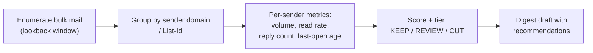

# Gmail Subscription Audit

Category-based cleanup catches the junk you can name. This skill catches the long tail you can't: the forty newsletters, digests, and promo lists that each seem harmless but together are most of your inbox. It measures which bulk senders you actually engage with, and reports — it never acts.

## Zero-mutation guarantee

This skill reads and computes. The only artifact it creates is a digest **draft** and an entry in the run log. No trashing, no labeling of user mail, no unsubscribing, no filter creation. All follow-through happens later, interactively, through the skills that own those actions (with Rule Zero and their preview gates intact). Because nothing here is destructive, this is the one skill that needs no profile preconditions to run — though it reads `config/profile.yaml` when present to annotate protected senders in the report.

## Method

1. **Enumerate** bulk mail over the lookback window (default 180 days): `category:promotions`, `category:updates`, and anything with a `List-Id`/`List-Unsubscribe` header. Sample message headers per sender when volume is large; note the sampling rate in the report.
2. **Group** by sender domain (fall back to full address for shared platforms like substack.com, mailchimp senders, etc. — group by List-Id there instead so distinct newsletters aren't merged).
3. **Measure per sender**, using counts of targeted searches (`from:X`, `from:X is:unread`, `from:X in:sent` on shared threads):
   - `volume` — messages in window
   - `read_rate` — 1 − (unread ÷ volume)
   - `replies` — threads with an owner reply (any reply ⇒ automatic KEEP)
   - `last_open_age` — days since the most recent read message
4. **Score**: `engagement = read_rate × recency_weight`, where recency_weight decays with `last_open_age` (reads six months ago shouldn't protect a sender forever). Precision beyond a simple decay is unnecessary — the tiers below have wide bands on purpose.
5. **Tier**:

| Tier | Heuristic | Recommendation |
|---|---|---|
| KEEP | replies > 0, or read_rate ≥ 30%, or protected by profile `never_touch` | Do nothing |
| REVIEW | read_rate 5–30%, or low volume (< 10), or any transactional-looking mail mixed in | Human judgment |
| CUT candidate | volume ≥ 20, read_rate < 5%, last open > 60 days, purely promotional | Unsubscribe + filter, via the interactive skills |

Any sender matching Rule Zero patterns (financial, medical, receipts) or profile `never_touch` lists is force-tiered KEEP and marked `protected` regardless of engagement — banks are read rarely and matter absolutely.

## The report

A digest draft (never sent) to the profile's `digest_recipient`:

- Headline stats: senders analyzed, total bulk volume, share of inbox, estimated volume reclaimed if all CUT candidates were unsubscribed.
- CUT candidates ranked by volume, each with its numbers (volume / read rate / last open) so the user can sanity-check every recommendation.
- REVIEW list with the reason each needs a human.
- Deltas vs. the previous audit (from the run log): new bulk senders, senders that moved tiers, whether past unsubscribes actually stopped the mail (escalate to a filter recommendation if not).
- A reminder that action happens via the maintenance-loop unsubscribe pass (opt-in, metered, never-list enforced) or the cleanup starters' filter pass — never via this skill.

Append a summary line to the run log (`logging.run_log`) so quarter-over-quarter trends accumulate in the same tracker the maintenance loop uses.

## Scheduling

Designed for a quarterly routine (see [`AUTOMATION.md`](../../AUTOMATION.md)). Safe at any frequency since it mutates nothing, but engagement statistics need a season of mail to be meaningful — more often than monthly just measures noise.
