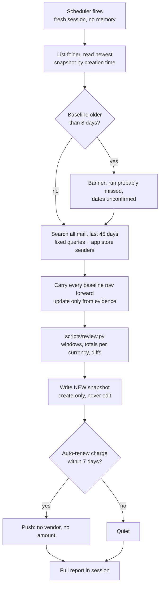
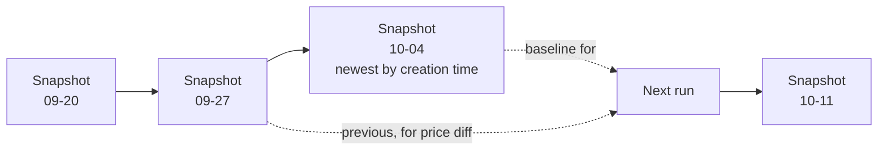
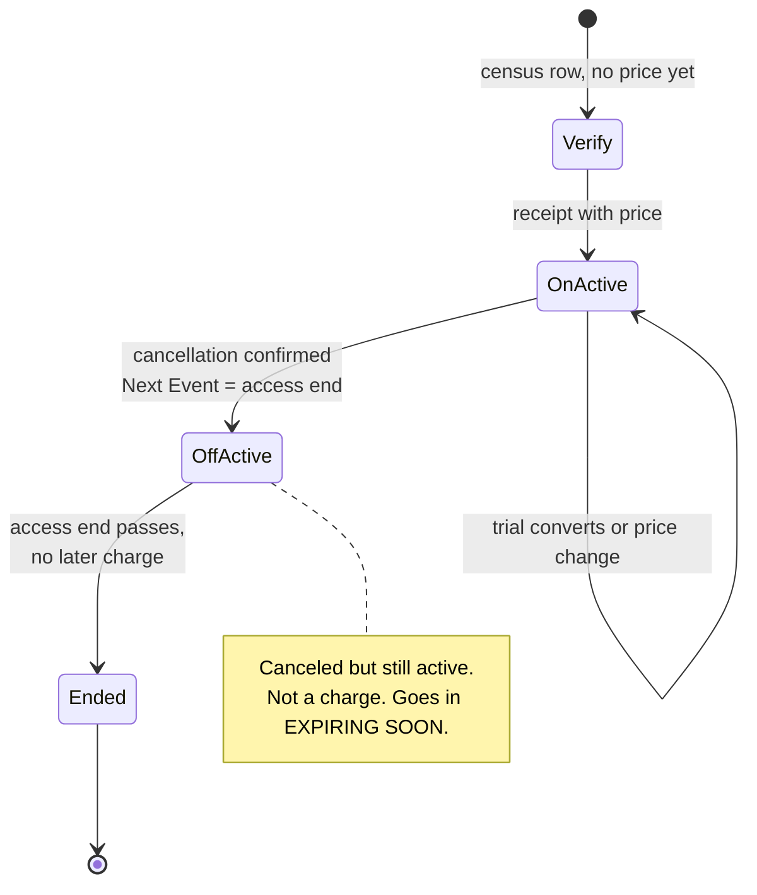
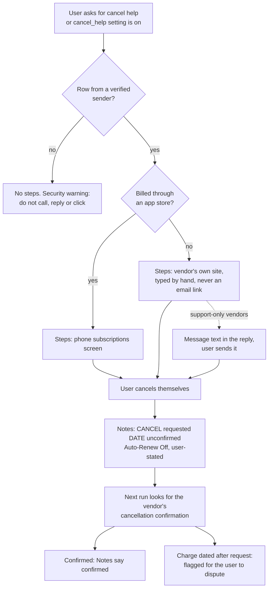

# Diagrams

Four views of the same skill. They render on GitHub. Everything here is synthetic.

## 1. One weekly run

## 2. Snapshots are a chain, not one file

The storage connector can create and read files but not edit or delete, so every
run writes a new file. The baseline is the newest by creation time, never by title.

## 3. Row states

Two independent columns. Canceled but still active is Auto-Renew Off, Status Active.

## 4. Cancellation help, opt-in

The skill writes text. The user acts. The next run checks.

